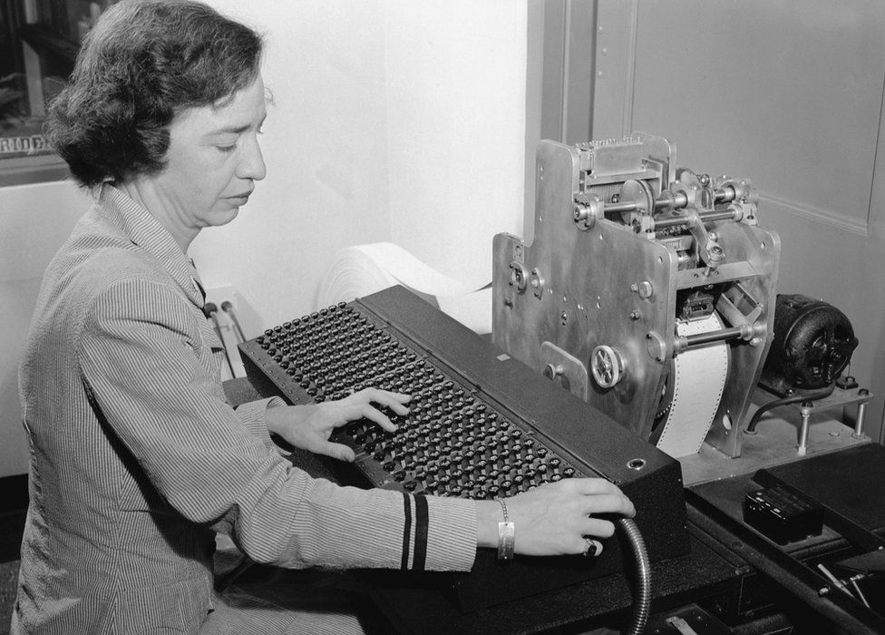

# Grace-Hopper-
<html>

<head>
    <meta charset="utf-8">
    <title>
       A História de Grace Hopper
    </title>
</head>

<body style="text-align: center">
    <h1>
        
 A história de Grace Hopper

    </h1>
    
    
    

    

        Grace Hopper foi uma matemática e física formada na
        "Varsy College". Ela começa a ter destaque durante a Segunda
        Guerra Mundial,quando entrou na marinha dos EUA e mais tarde
        particiou de um projeto em Havard onde aprendeu a programar
        o Mark I computer.Sua maior contribuição para a compútação
        foi quando entrou na Eckert-Mauchly Computer Corporation, e
        em 1952 ela e seu time criaram o primeiro compilador para
        linguagens de coomputador.Após isso, continuou na indústria computacional.
    

  
    
    
    <h1>
        Curiosidades
    </h1>
    

        Na vida da matemática, alguns dos seus feitos mais importantes foram:
        <li> Hopper ganhou a Medalha Nacional de Tecnologia </li>
        <li> É conhecida por ser a vovó do COBOL </li>
        <li> Grace deu o nome de bug para erros no computador, já que o problema na máquina estava sendo causado por um besouro </li>
    

    
</body>

</html>
